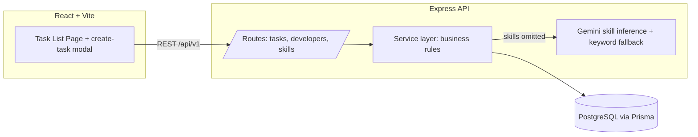

# Task Assignment Application

A full-stack task management app where tasks require specific skills, can be
assigned to developers who hold those skills, support arbitrarily nested
subtasks, and can have their required skills auto-classified by an LLM
(Gemini) when left unspecified.

- **Backend:** Node.js + TypeScript + Express + Prisma + PostgreSQL
- **Frontend:** React 19 + TypeScript + Vite (single-page app)
- **LLM:** Google Gemini (`@google/generative-ai`), with a deterministic
  keyword-based fallback when no API key is configured or the LLM call fails
- **Deployment:** Docker Compose (Postgres + backend + frontend)

## Table of contents

- [Architecture](#architecture)
- [Project structure](#project-structure)
- [Local development](#local-development)
- [Docker Compose](#docker-compose)
- [Database setup & migrations](#database-setup--migrations)
- [LLM configuration](#llm-configuration)
- [Logging](#logging)
- [API reference](#api-reference)
- [Business rules](#business-rules)
- [Testing](#testing)
- [Key libraries & rationale](#key-libraries--rationale)
- [Tested environment](#tested-environment)

## Architecture



Data model (see [backend/prisma/schema.prisma](backend/prisma/schema.prisma)):

- **Developer** ⇄ **Skill** — many-to-many via `DeveloperSkill`
- **Task** ⇄ **Skill** — many-to-many via `TaskSkill`
- **Task** → **Developer** — optional single assignment (`developerId`)
- **Task** → **Task** — optional self-relation (`parentTaskId`) for
  arbitrarily nested subtasks
- **Task.status** — enum `TODO | IN_PROGRESS | DONE`

Business rules (skill-compatibility checks, status-transition validation, and
recursive "all subtasks must be DONE" checks) live entirely in the backend
service layer (`backend/src/services/`), not in the database, and are
covered by unit and integration tests.

## Project structure

```
/backend
  src/
    config/        # env var loading & validation (zod)
    lib/            # prisma client singleton, logger
    middleware/      # error handler, async handler
    routes/          # express routers per resource
    controllers/     # thin HTTP handlers
    services/        # business logic (tasks, developers, skills, rules)
    validation/      # zod request schemas
    llm/             # Gemini client + skill inference w/ fallback
  prisma/            # schema.prisma, migrations, seed.ts
  tests/
    unit/            # mocked-Prisma unit tests
    integration/     # supertest + real Postgres test DB
/frontend
  src/
    api/             # typed fetch client per resource
    components/      # Modal, StatusSelect, DeveloperSelect, SkillBadges, TaskRow, NewTaskNode, ConfirmDeleteModal
    pages/           # TaskListPage (list view + create-task modal)
    hooks/           # useAsync.ts (useFetch, useAsyncAction)
    types/           # shared TS types mirroring backend DTOs
/docker-compose.yml
```

## Local development

Prerequisites: Node.js 22+, PostgreSQL 16 (local or via Docker), npm.

### 1. Backend

```bash
cd backend
npm install
cp .env.example .env   # then fill in DATABASE_URL and (optionally) GEMINI_API_KEY
npm run prisma:migrate # applies migrations to your local DB
npm run prisma:seed    # seeds Alice/Bob/Carol/Dave + Frontend/Backend skills
npm run dev            # starts the API on http://localhost:4000
```

Other backend scripts:

```bash
npm run build   # tsc -> dist/
npm start       # run the compiled server
npm run lint    # eslint
npm test        # jest (unit + integration — see Testing section)
```

### 2. Frontend

```bash
cd frontend
npm install
cp .env.example .env   # VITE_API_BASE_URL, defaults to http://localhost:4000/api/v1
npm run dev             # starts Vite on http://localhost:5173
```

Other frontend scripts: `npm run build`, `npm run lint`, `npm run preview`.

Open `http://localhost:5173` — the Task List page loads, with a "+ New Task"
button that opens the create-task form in a modal.

## Docker Compose

Brings up Postgres, the backend, and the frontend together:

```bash
cp .env.example .env   # set GEMINI_API_KEY at the repo root (optional)
docker-compose up --build
```

- Frontend: http://localhost:5173
- Backend API: http://localhost:4000/api/v1
- Postgres: localhost:5432 (user/pass `postgres`/`postgres`, db `task_assignment`)

The backend container automatically runs `prisma migrate deploy` on startup.
Seed the database once the stack is healthy:

```bash
docker-compose exec backend npx tsx prisma/seed.ts
```

Notes on the compose setup:

- `postgres` has a `pg_isready` healthcheck; `backend` depends on it via
  `condition: service_healthy`.
- `backend` has an HTTP healthcheck against `/api/v1/health`; `frontend`
  depends on `backend` being healthy before starting.
- Postgres data persists in the `postgres_data` named volume.
- The frontend's `VITE_API_BASE_URL` is baked in at build time (Vite inlines
  env vars into the bundle), configurable via the `VITE_API_BASE_URL` build
  arg in `docker-compose.yml`.
- If ports 5432/4000/5173 are already in use on your machine, override them
  under each service's `ports:` mapping (only the host-side port needs to
  change; inter-service communication uses the Docker network service names).
- The repo-root `.env` is also where you override `GEMINI_MODEL_STABLE`,
  `GEMINI_MODEL_FALLBACK`, and `LOG_PRETTY` for the containerized backend
  (`backend/.env` is not read inside Docker — see
  [LLM configuration](#llm-configuration) and [Logging](#logging)). Leave
  any of them unset and the backend's own built-in defaults apply.

## Database setup & migrations

Schema lives in [backend/prisma/schema.prisma](backend/prisma/schema.prisma).

```bash
cd backend
npm run prisma:migrate   # create/apply a migration in dev (prisma migrate dev)
npm run prisma:deploy    # apply existing migrations only (used in Docker/CI)
npm run prisma:seed      # idempotent seed: Frontend/Backend skills, Alice/Bob/Carol/Dave
npm run prisma:generate  # regenerate the Prisma client after schema changes
```

Seed mapping:

| Developer | Skills             |
|-----------|---------------------|
| Alice     | Frontend             |
| Bob       | Backend              |
| Carol     | Frontend, Backend    |
| Dave      | Backend              |

## LLM configuration

Skill inference uses Google Gemini via `@google/generative-ai`.

1. Get an API key from [Google AI Studio](https://aistudio.google.com/apikey).
2. Set it, and optionally override the model names, in the `.env` file for
   however you're running the backend:
   - **Local (non-Docker) dev** (`npm run dev`/`npm start` in `backend/`) —
     `backend/.env` (copy from `backend/.env.example`).
   - **Docker Compose** (`docker-compose up`) — the repo-root `.env` (copy
     from the root `.env.example`); `backend/.env` is not read inside the
     container.
   ```
   GEMINI_API_KEY=your-key-here
   GEMINI_MODEL_STABLE=gemini-flash-latest
   GEMINI_MODEL_FALLBACK=gemini-3.5-flash-lite
   ```
   Leave `GEMINI_MODEL_STABLE`/`GEMINI_MODEL_FALLBACK` unset in either file
   and the backend falls back to its own built-in defaults
   (`gemini-flash-latest` / `gemini-3.5-flash-lite`, defined once in
   [backend/src/config/env.ts](backend/src/config/env.ts) as the single
   source of truth) — no file needs to define them for the app to work.
3. When creating a task (or subtask) without a `skills` array, the backend
   calls Gemini with the task title and asks it to classify the task into
   `Frontend` and/or `Backend`. The result is normalized to those canonical
   names.

**Fallback behavior:** if `GEMINI_API_KEY` is unset, the request to
`GEMINI_MODEL_STABLE` fails, or its response can't be parsed as a JSON
array, the backend retries that model once, then tries
`GEMINI_MODEL_FALLBACK` (also retried once). Only if both models are
unavailable or fail does it fall back to deterministic keyword matching
(e.g. "UI", "page", "CSS" → Frontend; "API", "database", "migration" →
Backend) — task creation never fails because of the LLM. See
[backend/src/llm/skillInference.ts](backend/src/llm/skillInference.ts).

## Logging

The backend uses [pino](https://getpino.io) + `pino-http`. By default
(`LOG_PRETTY=true`) logs are human-readable, colorized single lines — e.g.
`GET /api/v1/tasks 200` — rather than raw JSON, and this applies in Docker
too, not just local dev. Request logs deliberately omit the bulky default
`req`/`res` objects (headers, remote address, etc.); only method, URL, and
status code are shown.

- Set `LOG_PRETTY=false` (`backend/.env` or the repo-root `.env` used by
  Compose) to emit raw structured JSON lines instead, e.g. when shipping
  logs to an aggregator that parses JSON.
- Logs are silenced entirely during `npm test` (`NODE_ENV=test`) so expected
  failure paths (like the LLM-fallback tests) don't spam the test output.

## API reference

Base URL: `http://localhost:4000/api/v1`

### Health

`GET /health` → `{ "status": "ok", "db": "ok" }`

### Tasks

| Method | Path         | Description |
|--------|--------------|-------------|
| POST   | `/tasks`     | Create a task (optionally with nested `subtasks`) |
| GET    | `/tasks`     | List all root tasks with nested subtasks |
| GET    | `/tasks/:id` | Get one task (with its full subtask subtree) |
| PATCH  | `/tasks/:id` | Update `status` and/or `developerId` |
| DELETE | `/tasks/:id` | Delete a task; cascades to all nested subtasks |

**Create** — `POST /tasks`

```json
{
  "title": "Build login form",
  "skills": ["Frontend"],
  "subtasks": [
    { "title": "Design form UI", "skills": ["Frontend"] },
    { "title": "Wire up auth API", "skills": ["Backend"] }
  ]
}
```

Omit `skills` (or pass `[]`) to have them inferred automatically — this
applies recursively to subtasks too:

```json
{ "title": "Design the dashboard UI" }
```

Response (`201`):

```json
{
  "id": "57b3c4db-374c-413f-8993-ded26c7dbf52",
  "title": "Build login form",
  "status": "TODO",
  "developer": null,
  "skills": ["Frontend"],
  "subtasks": [
    { "id": "...", "title": "Design form UI", "status": "TODO", "skills": ["Frontend"], "developer": null, "subtasks": [] },
    { "id": "...", "title": "Wire up auth API", "status": "TODO", "skills": ["Backend"], "developer": null, "subtasks": [] }
  ]
}
```

**Update** — `PATCH /tasks/:id`

```json
{ "status": "IN_PROGRESS" }
```
```json
{ "developerId": "ee790ff3-3d4e-4ee9-b4f7-572d11b0e048" }
```

**Delete** — `DELETE /tasks/:id`

Deletes the task and, via a cascading foreign key on `parentTaskId`, every
nested subtask beneath it (any depth). Returns `204` on success or `404` if
the task doesn't exist. The frontend warns the user and asks for
confirmation before deleting a task that has subtasks.

Error responses use a consistent shape:

```json
{ "error": { "code": "SKILL_MISMATCH", "message": "Developer is missing required skill(s): Backend" } }
```

| Code | HTTP status | When |
|------|-------------|------|
| `VALIDATION_ERROR` | 400 | Missing/invalid request payload |
| `NOT_FOUND` | 404 | Task/developer/skill id doesn't exist |
| `SKILL_MISMATCH` | 409 | Assigning a developer who lacks a required skill |
| `INVALID_STATUS_TRANSITION` | 409 | Disallowed status change (e.g. `TODO` → `DONE` directly) |
| `SUBTASKS_INCOMPLETE` | 409 | Marking `DONE` while a subtask (any depth) isn't `DONE` |

### Developers

| Method | Path              | Description |
|--------|-------------------|-------------|
| GET    | `/developers`     | List developers with their skills and assigned tasks |
| GET    | `/developers/:id` | Get one developer |

### Skills

| Method | Path         | Description |
|--------|--------------|-------------|
| GET    | `/skills`     | List skills with related developers and tasks |
| GET    | `/skills/:id` | Get one skill |

## Business rules

Enforced in [backend/src/services/taskRules.ts](backend/src/services/taskRules.ts):

- **Skill compatibility** — a developer can only be assigned to a task if
  their skill set is a superset of the task's required skills.
- **Status transitions** — allowed transitions are `TODO ↔ IN_PROGRESS` and
  `IN_PROGRESS ↔ DONE`; a direct `TODO → DONE` (or `DONE → TODO`) jump is
  rejected explicitly.
- **Recursive Done validation** — a task cannot be set to `DONE` while any
  subtask, at any nesting depth, is not `DONE`.
- **Cascading delete** — deleting a task also deletes every nested subtask
  beneath it (any depth), enforced via a cascading foreign key at the
  database level; the frontend requires explicit confirmation before
  deleting a task that has subtasks.

## Testing

```bash
cd backend
npm test
```

Runs both:

- **Unit tests** (`tests/unit/`) — business rules and LLM skill-inference
  normalization/fallback, using a mocked Prisma client and a mocked Gemini
  client (no network calls, deterministic).
- **Integration tests** (`tests/integration/`) — full HTTP requests via
  `supertest` against the real Express app, backed by a dedicated test
  Postgres database (configured in `tests/setupEnv.ts`, separate from your
  dev database so tests never touch seed data).

To run the integration suite you need a reachable Postgres instance; update
the connection string in `backend/tests/setupEnv.ts` if yours differs from
the default (`localhost:5439` in this repo's dev setup — adjust to your local
Postgres port).

## Key libraries & rationale

**Backend**
- **Express** — minimal, well-understood HTTP framework; sufficient for this API's scope without the overhead of a full framework like NestJS.
- **Prisma** — type-safe DB client + migrations in one tool; schema-first modeling maps cleanly onto the Developer/Skill/Task relations required here.
- **Zod** — runtime request validation with inferred TypeScript types, avoiding duplicated type/validation definitions.
- **Pino / pino-http** — low-overhead structured JSON logging suited to containerized deployments.
- **@google/generative-ai** — official Gemini SDK for skill inference.

**Frontend**
- **Vite** — fast dev server and build tooling with first-class TypeScript/React support.
- No router — the app is a single page (task list with a create-task modal), so client-side routing isn't needed.
- No additional data-fetching/state library — the app's data needs (list + a couple of mutations) are simple enough that a small custom `useFetch`/`useAsyncAction` hook pair avoids extra dependencies.

**Both**
- **TypeScript strict mode** end-to-end for compile-time safety across the API boundary.
- **ESLint + Prettier** for a consistent, enforced code style.

## Tested environment

Verified locally on:

| Tool | Version |
|------|---------|
| OS | Ubuntu 20.04.6 LTS |
| Node.js | v24.14.1 |
| npm | 11.11.0 |
| Docker | 28.1.1, build 4eba377 |
| Docker Compose | bundled with the above Docker Engine (V2 `docker compose` plugin) |

The app targets Node.js 22+ and PostgreSQL 16 (see [Local development](#local-development)); adjust the above if your setup differs.

## Repository

Source: https://github.com/registaz/xdigi
